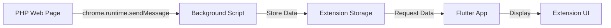

# Flutter Chrome Extension - PHP Data Bridge

A Chrome extension built with Flutter that enables seamless data transfer from PHP web pages to a Flutter-based extension interface.

## 🚀 Features

- **Real-time Data Transfer**: Send data from PHP pages directly to Flutter extension
- **Dual Display Modes**: Support for both popup and new window display
- **Secure Communication**: Uses Chrome's `externally_connectable` for secure data transfer
- **Print Functionality**: Built-in print support for received data
- **Modern Architecture**: Built with Flutter Web and Manifest V3

## 📋 Prerequisites

- Flutter SDK (latest stable version)
- Chrome Browser
- Local web server (for PHP testing)
- Basic knowledge of Flutter, PHP, and JavaScript

## 🛠️ Installation & Setup

### 1. Clone the Repository

```bash
git clone https://github.com/JAYAMURUGANJ/chrome_extension.git
cd chrome_extension
```

### 2. Install Flutter Dependencies

```bash
flutter pub get
```

### 3. Build the Extension

```bash
flutter build web --web-renderer html --csp
```

### 4. Load Extension in Chrome

1. Open Chrome and navigate to `chrome://extensions/`
2. Enable **Developer mode** (toggle in top-right corner)
3. Click **Load unpacked**
4. Select the `build/web` folder from your project
5. **Important**: Copy your extension ID for PHP integration

## 📁 Project Structure

```
chrome_extension/
├── lib/
│   └── main.dart              # Flutter app logic
├── web/
│   ├── manifest.json          # Extension configuration
│   ├── background.js          # Service worker
│   ├── index.html            # Extension popup HTML
│   └── icons/                # Extension icons
├── php_example/
│   └── index.php             # PHP integration example
└── build/
    └── web/                  # Built extension files
```

## ⚙️ Configuration

### manifest.json
```json
{
  "manifest_version": 3,
  "name": "Flutter Chrome Extension",
  "version": "1.0",
  "action": {
    "default_popup": "index.html",
    "default_icon": "icons/Icon-192.png"
  },
  "externally_connectable": {
    "matches": [
      "http://localhost/*",
      "http://127.0.0.1/*"
    ]
  },
  "background": {
    "service_worker": "background.js"
  },
  "permissions": ["storage", "activeTab"]
}
```

### Update PHP Extension ID

In your `index.php` file, replace the extension ID:

```javascript
const extensionId = "YOUR_EXTENSION_ID_HERE"; // Replace with your actual extension ID
```

## 🔄 How It Works



1. **PHP Page** sends data using Chrome's runtime messaging API
2. **Background Script** receives and stores the data
3. **Flutter App** requests stored data from background script
4. **Extension UI** displays the received data

## 📝 Usage Example

### PHP Side (Sending Data)

```php
<?php
$data = [
    "title" => "Hello from PHP!",
    "content" => "This data is sent to Flutter.",
    "timestamp" => date("Y-m-d H:i:s"),
    "action" => "open_extension"
];
?>

<script>
const extensionId = "your-extension-id";
const message = <?php echo json_encode($data); ?>;

chrome.runtime.sendMessage(extensionId, message, function(response) {
    console.log("Response:", response);
});
</script>
```

### Flutter Side (Receiving Data)

```dart
void _requestLatestData() {
  final chrome = js.context['chrome'];
  if (chrome != null) {
    final runtime = chrome['runtime'];
    runtime.callMethod('sendMessage', [
      "get_latest_data",
      js.allowInterop((response) {
        if (response != null) {
          final jsonString = js.context['JSON'].callMethod('stringify', [response]);
          final parsedData = json.decode(jsonString);
          setState(() {
            _receivedData = Map<String, dynamic>.from(parsedData);
            _displayText = _receivedData?['content'] ?? "No content received";
          });
        }
      })
    ]);
  }
}
```

## 🧪 Testing

1. **Start Local Server**: Run your PHP file on a local server (e.g., `http://localhost/index.php`)
2. **Load Extension**: Install the extension in Chrome
3. **Send Data**: Click buttons on your PHP page to send data
4. **View Results**: See data displayed in the Flutter extension

## 🔒 Security Features

- **Restricted Origins**: Only accepts messages from `localhost` domains
- **Content Security Policy**: CSP-compliant build for enhanced security
- **Manifest V3**: Uses the latest Chrome extension security standards

## 📱 Display Modes

### Popup Mode
```javascript
"action": "open_extension"  // Opens in extension popup
```

### Window Mode
```javascript
"action": "popup_extension" // Opens in new window (400x600px)
```

## 🛠️ Development

### Running in Development

```bash
# Start Flutter web server for development
flutter run -d chrome --web-port 8080
```

### Building for Production

```bash
# Build optimized version
flutter build web --web-renderer html --csp --release
```

## 📋 Available Actions

| Action | Description | Display Mode |
|--------|-------------|--------------|
| `open_extension` | Opens extension in popup | Popup overlay |
| `popup_extension` | Opens extension in new window | Standalone window |
| Custom actions | Store data for later retrieval | Background storage |

## 🎨 Customization

### Updating Extension Size

In `index.html`:
```html
<html style="height: 600px; width: 350px">
```

### Adding New Data Fields

Update your PHP data structure:
```php
$data = [
    "title" => "Your Title",
    "content" => "Your Content",
    "custom_field" => "Custom Value",
    "timestamp" => date("Y-m-d H:i:s"),
    "action" => "open_extension"
];
```

## 🐛 Troubleshooting

### Common Issues

**Extension not receiving data:**
- Verify extension ID is correct in PHP
- Check if localhost is running
- Ensure `externally_connectable` matches your domain

**Build errors:**
- Run `flutter clean` then `flutter pub get`
- Ensure Flutter web is enabled: `flutter config --enable-web`

**Chrome extension not loading:**
- Check manifest.json syntax
- Verify all required files are in build/web folder
- Enable Developer mode in Chrome

## 🤝 Contributing

1. Fork the repository
2. Create your feature branch (`git checkout -b feature/AmazingFeature`)
3. Commit your changes (`git commit -m 'Add some AmazingFeature'`)
4. Push to the branch (`git push origin feature/AmazingFeature`)
5. Open a Pull Request

## 📄 License

This project is licensed under the MIT License - see the [LICENSE](LICENSE) file for details.

## 👨‍💻 Author

**JAYAMURUGAN J**
- GitHub: [@JAYAMURUGANJ](https://github.com/JAYAMURUGANJ)

## ⭐ Show your support

Give a ⭐️ if this project helped you!

## 📚 Additional Resources

- [Flutter Web Documentation](https://flutter.dev/web)
- [Chrome Extension Development](https://developer.chrome.com/docs/extensions/)
- [Manifest V3 Migration Guide](https://developer.chrome.com/docs/extensions/migrating/)

---

**Note**: Remember to replace `YOUR_EXTENSION_ID_HERE` with your actual extension ID from Chrome's extension management page.